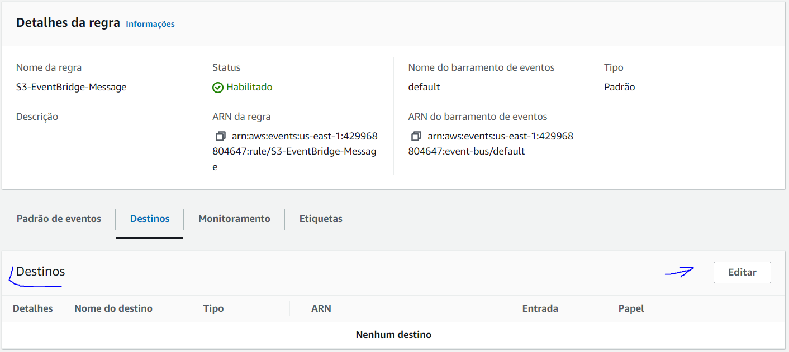
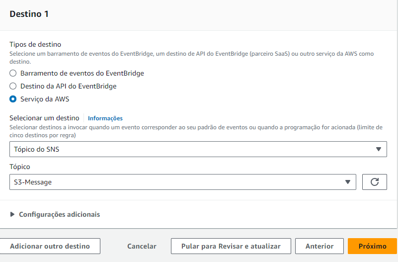

# AWS

## Topicos 
- [AWS](#aws)
  - [Topicos](#topicos)
  - [Notifcação via e-mail quando um objeto é carregado em um bucket no S3](#notifcação-via-e-mail-quando-um-objeto-é-carregado-em-um-bucket-no-s3)
  - [Depois mude a politica de acesso para que o S3 tenha acesso ao SNS](#depois-mude-a-politica-de-acesso-para-que-o-s3-tenha-acesso-ao-sns)
  - [Criando a Assinatura](#criando-a-assinatura)
  - [Criando a regra no EventBridge](#criando-a-regra-no-eventbridge)
    - [utilizei o seguinte para o padrão do evento](#utilizei-o-seguinte-para-o-padrão-do-evento)
  - [Criando o bucket e usuario sem permissão de delete no AWS CLI](#criando-o-bucket-e-usuario-sem-permissão-de-delete-no-aws-cli)
    - [Primeiro criando a política de acesso](#primeiro-criando-a-política-de-acesso)
    - [Utilizei a  seguinte política](#utilizei-a--seguinte-política)
  - [Criando o usuario](#criando-o-usuario)
  - [Caso precise de login via console](#caso-precise-de-login-via-console)
  - [Criando as chaves de acesso](#criando-as-chaves-de-acesso)
  - [Anexando a política](#anexando-a-política)
  - [Criando o bucket](#criando-o-bucket)
  - [Setando a configuração de notificação do evento](#setando-a-configuração-de-notificação-do-evento)

## Notifcação via e-mail quando um objeto é carregado em um bucket no S3

Primeiro é a criação de um tópico 

    aws sns create-topic --name 'nome do topico'

## Depois mude a politica de acesso para que o S3 tenha acesso ao SNS

    aws sns set-topic-attributes --topic-arn 'ARN do tópico' --attribute-name Policy --attribute-value file://'nome do arquivo .json'

Utilizei a seguinte política

    {
        "Version": "2012-10-17",
        "Id": "example-ID",
        "Statement": [
        {
            "Sid": "Example SNS topic policy",
            "Effect": "Allow",
            "Principal": {
            "Service": "s3.amazonaws.com"
            },
            "Action": "SNS:Publish",
            "Resource": 'ARN do tópico',
            "Condition": {
            "StringEquals": {
                "aws:SourceAccount": "429968804647"
            },
            "ArnLike": {
                "aws:SourceArn": "arn:aws:s3:*:*:*"
            }
            }
        }
        ]
    }
    
## Criando a Assinatura

    aws sns subscribe --topic-arn 'ARN do topico criado' --protocol email --notification-endpoint 'e-mail para notificação'

## Criando a regra no EventBridge

    aws events put-rule  --name 'nome da regra' --event-pattern file://arquivo .json

### utilizei o seguinte para o padrão do evento

    {
        "source": ["aws.s3"],
        "detail-type": ["Object Created"]
    }

Agora setando o destino que é o nosso SNS

Ainda não achei como fazer isso por CLI, então vamos pelo console 

Primeiro na area do EventBridge vá na regra e depois em destinos

Depois no tipo de destino 'Serviço AWS', 'Tópico SNS' e selecione o seu tópico

Só dar next até o final e criar 

## Criando o bucket e usuario sem permissão de delete no AWS CLI

### Primeiro criando a política de acesso

    aws iam create-policy --policy-name 'nome da política' --policy-document file://'caminho do arquivo .json'

### Utilizei a  seguinte política

    {
        "Version": "2012-10-17",
        "Statement": [
            {
                "Effect": "Allow",
                "Action": [
                    "s3:PutObject",
                    "s3:GetObject",
                    "s3:ListBucketVersions",
                    "s3:CreateBucket",
                    "s3:ListBucket",
                    "s3:GetBucketVersioning",
                    "s3:GetBucketNotification",
                    "s3:PutBucketVersioning",
                    "s3:PutObjectAcl",
                    "s3:ListAllMyBuckets",
                    "s3:GetObjectVersion"
                ],
                "Resource": [
                    "arn:aws:s3:::*/*"                
                ]
            }
        ]
    }

## Criando o usuario 

    aws iam create-user --user-name 'nome de usuario'

## Caso precise de login via console

    aws iam create-login-profile --user-name 'nome de usuario' --password 'senha' --password-reset-required    

## Criando as chaves de acesso

    aws iam create-access-key --user-name 'nome de usuario'

## Anexando a política

Primeiro para pegar o ARN da política
 
    aws iam list-policies --scope Local 
Com o ARN copiado 
 
    aws iam attach-user-policy --user-name 'usuario criado' --policy-arn 'arn da política'

## Criando o bucket
  
    aws s3api create-bucket --bucket 'nome do bucket' --region us-east-1

## Setando a configuração de notificação do evento 

    aws s3api put-bucket-notification-configuration --bucket 'nome do bucket' --notification-configuration file://'arquivo .json'

Utilizei a seguinte config, tera evento sempra que um objeto for criado

    {
        "TopicConfigurations": [
            {
                "Id": "NotificationS3",
                "TopicArn": "arn:aws:sns:us-east-1:429968804647:S3-Message",
                "Events": [
                    "s3:ObjectCreated:*"
                ],
                "Filter": {
                    "Key": {
                        "FilterRules": [
                            {
                                "Name": "Prefix",
                                "Value": ""
                            },
                            {
                                "Name": "Suffix",
                                "Value": ""
                            }
                        ]
                    }
                }
            }
        ]
    }

